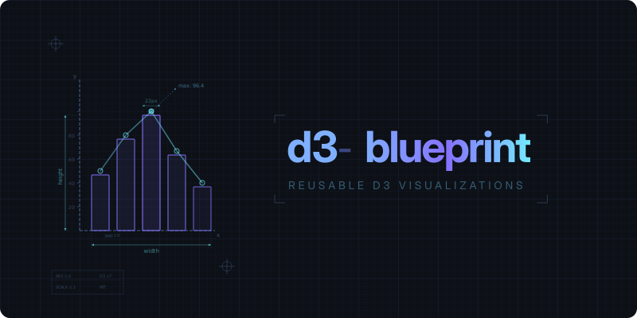

<p align="center">
  <a href="https://pirhoo.github.io/d3-blueprint/" align="center">
    
  </a>
</p>
<p align="center"><strong>A modern micro-framework for building reusable, composable D3 charts with TypeScript.</strong></p>

<div align="center">

|      | Status |
| ---: | :--- |
| **CI checks** | [](https://github.com/pirhoo/d3-blueprint/actions/workflows/main.yml) |
| **Latest version** | [](https://www.npmjs.com/package/d3-blueprint) |
|   **Release date** | [](https://github.com/pirhoo/d3-blueprint/releases/latest) |
|    **Open issues** | [](https://github.com/pirhoo/d3-blueprint/issues/) |
|  **Documentation** | [](https://pirhoo.gitbook.io/d3-blueprint/guide/getting-started.html) [](https://pirhoo.gitbook.io/d3-blueprint/api/) |

</div>

## Features

* **Composable Layers**: Each layer owns its D3 data-join lifecycle (enter, merge, exit, and transitions). Combine layers freely to build complex visualizations from simple building blocks.
* **Reactive Config**: Define typed config properties with getter/setter transforms and default values. Change a config, call `draw()`, and watch everything update.
* **Plugin System**: Encapsulate cross-cutting behavior like tooltips, crosshairs, and responsive resize into reusable plugins that hook into the chart lifecycle automatically.
* **Nested Attachments**: Compose charts from smaller charts. Attach reusable sub-components like axes or legends that draw in sync with the parent.
* **Built-in Transitions**: Layers support transition events out of the box. Animate enter, merge, and exit phases with `d3-transition` with no manual wiring needed.
* **Tiny & Dependency-Free**: Only peer-depends on `d3-selection` and `d3-transition`. Bring your own scales, shapes, and layouts with no monolithic D3 bundle required.

## Quickstart

Install d3-blueprint from NPM:

```bash
npm install d3-blueprint d3-selection
```

Then create your first chart:

```js
import { D3Blueprint } from 'd3-blueprint';
import { select } from 'd3-selection';

class BarChart extends D3Blueprint {
  initialize() {
    const svg = this.base.append('svg').attr('width', 400).attr('height', 200);
    const group = svg.append('g');

    this.layer('bars', group, {
      dataBind(selection, data) {
        return selection.selectAll('rect').data(data);
      },
      insert(selection) {
        return selection.append('rect');
      },
      events: {
        merge(selection) {
          selection
            .attr('x', (d, i) => i * 45)
            .attr('y', (d) => 200 - d.value * 4)
            .attr('width', 40)
            .attr('height', (d) => d.value * 4)
            .attr('fill', '#6878E8');
        },
      },
    });
  }
}

const chart = new BarChart(select('#app'));

chart.draw([
  { label: 'A', value: 30 },
  { label: 'B', value: 45 },
  { label: 'C', value: 20 },
  { label: 'D', value: 50 },
]);
```

## Draw Lifecycle

When you call `chart.draw(data)`, the following sequence executes:

```
constructor(selection)
  └── initialize()

draw(data)
  ├── transform(data) → transformedData
  ├── preDraw(transformedData)
  ├── emit "preDraw" event
  ├── layers.draw(transformedData)       ← each layer runs its data-join lifecycle
  ├── attachments.draw(transformedData)
  ├── postDraw(transformedData)
  ├── emit "postDraw" event
  ├── await all transitions
  ├── postTransition(transformedData)
  └── emit "postTransition" event
```

## Plugins

Encapsulate reusable behavior with the plugin system:

```js
import { D3Blueprint } from 'd3-blueprint';

const tooltipPlugin = {
  name: 'tooltip',
  install(chart) {
    chart.tooltipEl = chart.base.append('div').attr('class', 'tooltip');
  },
  postDraw(chart, data) {
    // Wire tooltip events after each draw
  },
  destroy(chart) {
    chart.tooltipEl?.remove();
  },
};

class MyChart extends D3Blueprint {
  initialize() {
    this.usePlugin(tooltipPlugin);
  }
}
```

See the [Plugins Documentation](https://pirhoo.gitbook.io/d3-blueprint/guide/plugins.html) for built-in plugins and custom plugin guides.

## Next Steps

Find out more about how to use d3-blueprint on the official [documentation](https://pirhoo.gitbook.io/d3-blueprint).
